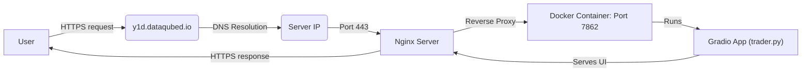

# Stock Market Prediction Gradio App

## Overview

This application provides a web interface built with Gradio for predicting stock market prices based on historical data. It allows users to select a stock ticker, granularity, prediction model, and other parameters to visualize historical data and future predictions.

The application is designed to be deployed using Docker for containerization and Nginx as a reverse proxy for automatic HTTPS via Certbot.

**Technology Stack:**

*   **Backend:** Python
*   **Web Framework/UI:** Gradio
*   **Data Handling:** Pandas, Requests
*   **Machine Learning:** Scikit-learn
*   **Containerization:** Docker
*   **Web Server/Reverse Proxy:** Nginx (with Certbot for HTTPS)
*   **Code Quality:** pre-commit (for commit message linting)

## Prerequisites

Before you begin, ensure you have the following:

*   **Git:** For cloning the repository.
*   **Linux Server:** A server (e.g., Ubuntu 20.04+) where you will deploy the application. You need `sudo` access.
*   **Docker:** Docker installed and running on the deployment server.
*   **Domain Name:** A domain name (e.g., `y1d.dataqubed.io`) pointed to your server's public IP address via DNS A record.
*   **(For Development):** Python 3.11+ and `pip`.

## Architecture Overview

The production setup follows this flow:

1.  **User Request:** The user accesses `https://y1d.dataqubed.io`.
2.  **DNS:** The domain resolves to the server's IP address.
3.  **Nginx:** Nginx receives the request on port 443 (HTTPS). It handles TLS certificate termination (certificates managed by Certbot).
4.  **Reverse Proxy:** Nginx forwards the request internally to the application container running on port 7862.
5.  **Docker Container:** The container runs the Gradio application (`trader.py`).
6.  **Gradio App:** The Python application processes the request and serves the web interface.



## Production Deployment (Step-by-Step)

These steps guide you through deploying the application on your Linux server.

**1. Clone the Repository**

```bash
git clone https://github.com/mdavarynejad/sm-gradio.git
cd sm-gradio
```

**2. Server Preparation**

*   **Update System Packages:**
    ```bash
    sudo apt-get update && sudo apt-get upgrade -y
    ```
*   **Install Docker (if not already installed):**
    ```bash
    sudo apt-get install docker.io -y
    sudo systemctl start docker
    sudo systemctl enable docker
    # Optional: Add user to docker group to avoid using sudo for docker commands
    # sudo usermod -aG docker $USER
    # newgrp docker # Requires logout/login or new shell
    ```
*   **Configure Firewall:** Allow incoming traffic on ports 80 (for HTTP ACME challenge) and 443 (for HTTPS). Port 7862 does *not* need to be publicly open as Nginx accesses it internally.
    ```bash
    sudo ufw allow 'Nginx Full' # Allows both 80 and 443
    sudo ufw reload
    sudo ufw status
    ```

**3. Run Application Container**

Use the provided Python script to build the Docker image and run the container in detached mode with an auto-restart policy.

```bash
python3 run_docker.py
```

*   **What this script does:**
    *   Checks if Docker is running.
    *   Builds a Docker image named `move-app:latest` using the `Dockerfile`.
    *   Stops and removes any existing container named `move-app-container`.
    *   Starts a new container named `move-app-container` from the `move-app:latest` image.
    *   Runs the container in detached mode (`-d`).
    *   Sets the restart policy to `unless-stopped`, so it restarts automatically.
    *   Maps port `7862` inside the container to port `7862` on the host server.
    *   Mounts a host directory `/root/move_data` to `/workspace/move_data` inside the container. *(Note: Ensure this volume mount is necessary and the host path `/root/move_data` exists or adjust as needed).*
    *   *(Note: The script uses the names `move-app` and `move-app-container`. Consider updating the script and `Dockerfile` for names consistent with the repository, e.g., `sm-gradio`, if desired).*

**4. Install Nginx**

Install the Nginx web server on the host machine.

```bash
sudo apt-get update
sudo apt-get install nginx -y
sudo systemctl start nginx
sudo systemctl enable nginx
```

**5. Configure Nginx Reverse Proxy**

Create an Nginx server block configuration file for your domain. Replace `y1d.dataqubed.io` with your actual domain name in the commands and file content below.

*   **Copy the example configuration to your server:** First, copy the example configuration file from the repository (`nginx.conf.example`) to your server's Nginx sites-available directory. You might use `scp` or other methods. Then, rename it on the server:
    ```bash
    # Example using scp (run from your local machine):
    # scp nginx.conf.example user@your_server_ip:/etc/nginx/sites-available/y1d.dataqubed.io

    # Or, if you cloned the repo on the server:
    sudo cp nginx.conf.example /etc/nginx/sites-available/y1d.dataqubed.io
    ```
*   **Edit the configuration file:** Open the copied file on the server using `vim` and replace all instances of the placeholder `y1d.dataqubed.io` with your actual domain name.
    ```bash
    sudo vim /etc/nginx/sites-available/y1d.dataqubed.io
    ```
*   **Enable the site by creating a symbolic link:**
    ```bash
    sudo ln -s /etc/nginx/sites-available/y1d.dataqubed.io /etc/nginx/sites-enabled/
    ```
*   **Test the Nginx configuration:**
    ```bash
    sudo nginx -t
    ```
*   **Reload Nginx if the test is successful:**
    ```bash
    sudo systemctl reload nginx
    ```

**6. Install Certbot and Obtain SSL Certificate**

Install Certbot and its Nginx plugin to automatically obtain and manage Let's Encrypt SSL certificates.

```bash
sudo apt-get install certbot python3-certbot-nginx -y
```

Run Certbot, specifying your domain name. Follow the prompts. Certbot will automatically modify your Nginx configuration to enable HTTPS. (Replace `y1d.dataqubed.io` with your domain)

```bash
sudo certbot --nginx -d y1d.dataqubed.io
```

Certbot will also set up automatic renewal. You can test the renewal process with:

```bash
sudo certbot renew --dry-run
```

> **Important Note:** Certbot attempts to automatically modify your Nginx configuration. Occasionally, especially with complex existing files, it might not structure the final configuration correctly, potentially leading to redirect loops (like a 301 error even on HTTPS). 
> After running Certbot, it's wise to inspect the configuration file (`sudo cat /etc/nginx/sites-enabled/y1d.dataqubed.io`). Ensure it looks similar to the structure below, with one block for HTTP redirects and a separate block for HTTPS handling the proxy pass. If it looks incorrect (e.g., SSL directives mixed into the port 80 block, or duplicate redirects), manually edit `/etc/nginx/sites-available/y1d.dataqubed.io` to match the correct structure, test with `sudo nginx -t`, and reload with `sudo systemctl reload nginx`.
>
> ```nginx
> # Correct structure example:
> server {
>     listen 80;
>     server_name y1d.dataqubed.io; # Your domain
> 
>     # Redirect HTTP to HTTPS (managed by Certbot)
>     location / {
>         # Certbot might adjust this part slightly
>         return 301 https://$host$request_uri;
>     }
> }
> 
> server {
>     listen 443 ssl http2; # Ensure listen 443 ssl is present
>     server_name y1d.dataqubed.io; # Your domain
> 
>     # SSL configuration directives (managed by Certbot)
>     ssl_certificate /etc/letsencrypt/live/y1d.dataqubed.io/fullchain.pem;
>     ssl_certificate_key /etc/letsencrypt/live/y1d.dataqubed.io/privkey.pem;
>     include /etc/letsencrypt/options-ssl-nginx.conf;
>     ssl_dhparam /etc/letsencrypt/ssl-dhparams.pem;
> 
>     location / {
>         # Your proxy pass directives here
>         proxy_pass http://localhost:7862; 
>         proxy_set_header Host $host;
>         proxy_set_header X-Real-IP $remote_addr;
>         proxy_set_header X-Forwarded-For $proxy_add_x_forwarded_for;
>         proxy_set_header X-Forwarded-Proto $scheme;
>         proxy_http_version 1.1;
>         proxy_set_header Upgrade $http_upgrade;
>         proxy_set_header Connection "upgrade";
>         proxy_read_timeout 86400;
>     }
> }
> ```

**7. Verification**

Wait a minute or two for DNS propagation if you just set up the domain. Then, open your web browser and navigate to `https://y1d.dataqubed.io` (replace with your domain). You should see the Gradio application interface served securely over HTTPS via Nginx.

## Development Setup

Follow these steps to set up a local environment for development and contribution.

**1. Clone the Repository**

```bash
git clone https://github.com/mdavarynejad/sm-gradio.git
cd sm-gradio
```

**2. Create and Activate Virtual Environment**

It's highly recommended to use a virtual environment.

```bash
python3 -m venv venv
source venv/bin/activate
# On Windows use: venv\Scripts\activate
```

**3. Install Dependencies**

Install all required Python packages, including development tools like `pre-commit`.

```bash
pip install --upgrade pip
pip install -r requirements.txt
```

**4. Set Up Commit Message Linting (pre-commit)**

This project uses `pre-commit` and the `conventional-pre-commit` hook to enforce the [Conventional Commits](https://www.conventionalcommits.org/) standard locally.

*   **Install the Git hook:** Run this command once within the repository:
    ```bash
    pre-commit install --hook-type commit-msg
    ```

Now, before finalizing any commit, the hook will automatically check your commit message format. If it's non-compliant, the commit will be aborted with an error message.

**5. Run Locally**

You can run the Gradio app directly for local testing (this will *not* use Docker or Nginx).

```bash
python trader.py
```

The app will typically be available at `http://127.0.0.1:7862`.

## Project Structure (Brief)

```
.
├── .git/                 # Git directory
├── .gitignore            # Specifies intentionally untracked files that Git should ignore
├── .pre-commit-config.yaml # Configuration for pre-commit hooks
├── data/                 # Data handling scripts/modules
│   └── data_handling.py
├── venv/                 # Python virtual environment (if created locally)
├── Dockerfile            # Instructions for building the Docker image
├── README.md             # This file
├── app.py                # Simple Gradio app (potentially unused)
├── main.py               # Simple main script (potentially unused)
├── prediction_plot.png   # Example output image
├── requirements.txt      # Python dependencies
├── run_docker.py         # Script to automate Docker build and run
└── trader.py             # Main Gradio application script for stock prediction
```


